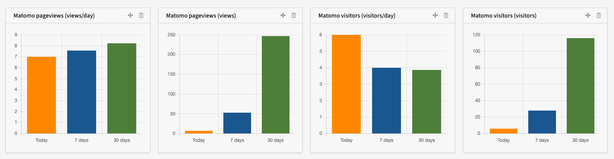

# Mittwald TYPO3 Extension ``mw_matomo_widget``

## What does it do?

Mittwald Matomo Widget is an extension for TYPO3 CMS to show visitor and page views in the TYPO3 dashboard.
The extension fetches statistics via the Matomo API and uses the TYPO3 caching framework to cache results
for one hour.

## Screenshots

## Installation

1) Install the extension from the TYPO3 Extension Repository or using composer
2) Open the extension configuration and set "Matomo URL", "API Token" and "Site ID"
3) Add one of the available Matomo Widgets to the TYPO3 dashboard 

## Configuration

In order to use the extension, it is required to configure Matomo settings.

* **Matomo URL:** The URL to your Matomo instance (e.g. `https://matomo.domain.tld/`)
* **API Token:** The API token for Matomo
* **Site ID:** The Matomo site ID

## TYPO3 Compatibility

| Version | TYPO3      | PHP       | Support/Development                     |
|---------| ---------- | ----------|---------------------------------------- |
| 2.x     | 11.5       | >= 7.4    | Features, Bugfixes, Security Updates    |
| 1.x     | 10.4       | 7.2 - 7.4 | Features, Bugfixes, Security Updates    |
